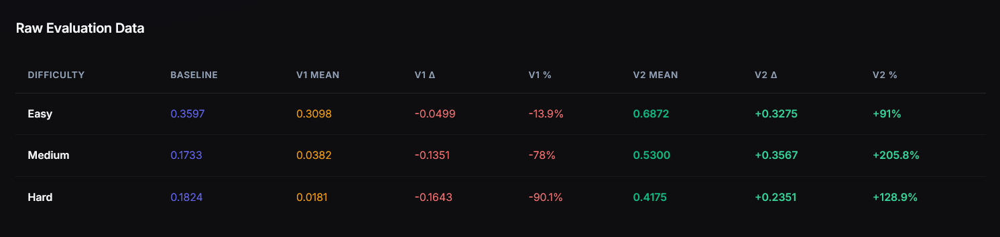
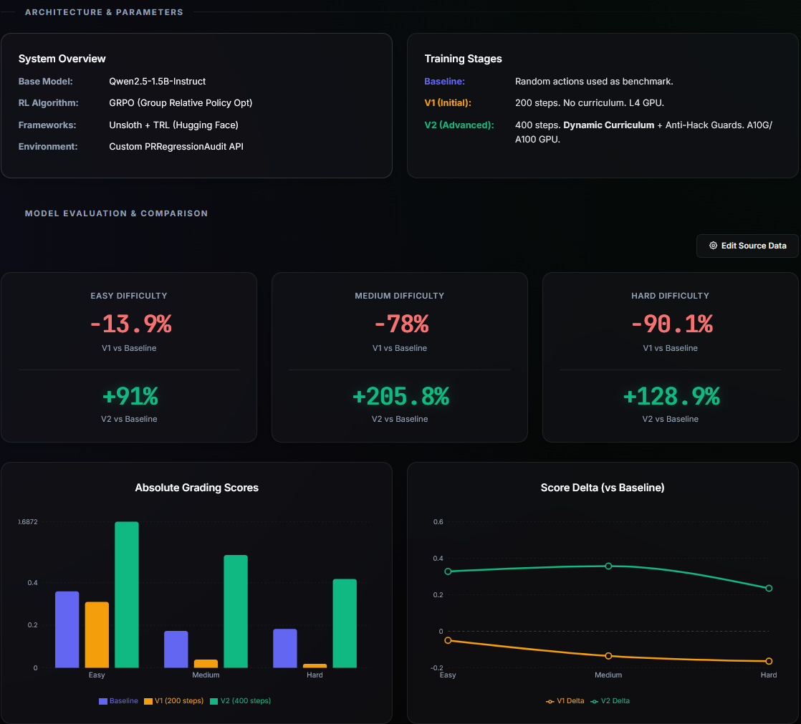
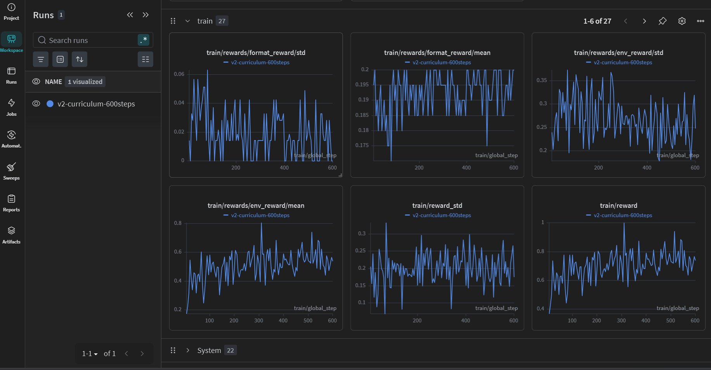
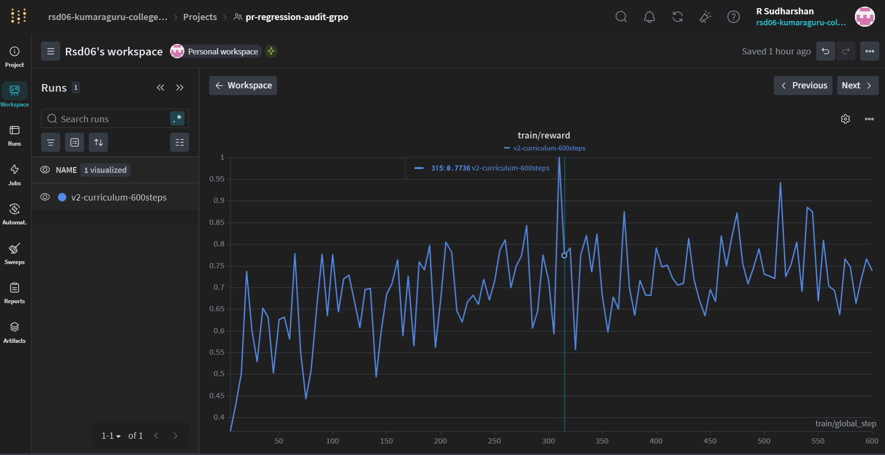
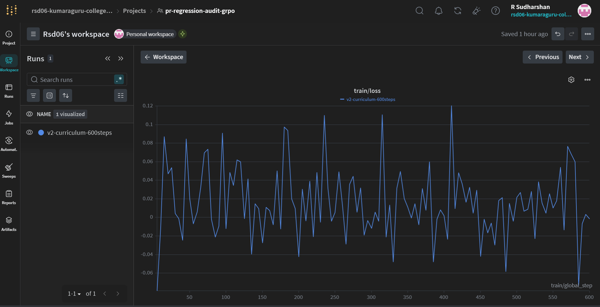

# PRRegressionAudit RLEnvironment and Self-Improving Multi-Agent Code Reviewer 🔍

**Created by Team GitHappens! (R Sudharshan & Sai Sanjay R)**


**Automated PR Regression Auditor** — a high-fidelity reinforcement learning environment where LLM agents act as senior code reviewers catching accidental defects in Pull Requests. Built for the **Meta × Scaler OpenEnv Hackathon 2026**.

> **"PR descriptions always describe the intended feature — never the flaw. This project aims to solve that by identifying deep-seated regressions and code breaks affecting the broader codebase that a human reviewer might easily miss."**

> 📝 **[Read our full technical writeup/mini-blog here →](https://github.com/SAISANJAYR/GitPRTriageEnv/blob/main/Blog.MD)**

---

## 🔗 Important Links & Resources

| Resource | Hugging Face URL |
|----------|------------------|
| 🌐 **Live Environment (Space)** | [rsd-06/PRRegressionAuditEnv](https://huggingface.co/spaces/rsd-06/PRRegressionAuditEnv) |
| **📝 Mini Blog / Technical Writeup** | **[Blog.MD on GitHub](https://github.com/SAISANJAYR/GitPRTriageEnv/blob/main/Blog.MD)** |
| 🗒️ **Training Notebook (Colab-ready)** | [grpo_training.ipynb](https://github.com/SAISANJAYR/GitPRTriageEnv/blob/main/training/grpo_training.ipynb) |
| 📊 **GRPO Training Dataset (V1)** | [SaiSanjayR/pr-regression-audit-grpo](https://huggingface.co/datasets/SaiSanjayR/pr-regression-audit-grpo) |
| 📊 **GRPO Training Dataset (V2)** | [rsd-06/pr-regression-audit-grpo](https://huggingface.co/datasets/rsd-06/pr-regression-audit-grpo) |
| 🧠 **Trained Model V1 (Adapter)** | [SaiSanjayR/pr-triage-grpo-adapter](https://huggingface.co/SaiSanjayR/pr-triage-grpo-adapter) |
| 🚀 **Trained Model V2 (Curriculum)** | [rsd-06/pr-regression-audit-grpo-adapter-v2](https://huggingface.co/rsd-06/pr-regression-audit-grpo-adapter-v2) |

---

## 📈 Model Training Stages & Results

Our RL agent was progressively trained using **GRPO (Group Relative Policy Optimization)**. We evolved the model through three distinct stages to conquer the PR Regression Audit environment.

### Stage 0: Baseline (Untrained Qwen2.5-1.5B-Instruct)
The base instruction-tuned model. While it understands code, it completely lacks the domain-specific rigor to consistently identify the exact faulty lines, match the strict keyword constraints, and perfectly format the complex JSON output required by the environment's deterministic grader.
- **Easy Avg:** 0.3597
- **Medium Avg:** 0.1733
- **Hard Avg:** 0.1824

### Stage 1: GRPO Trained (V1)
Trained for 200 steps on an L4 GPU without Curriculum Learning. The model attempted to learn the required JSON schema but suffered from format hallucinations and struggled massively with class imbalance, leading to a degradation in performance compared to random guessing baseline.
- **Easy Avg:** 0.3098
- **Medium Avg:** 0.0382
- **Hard Avg:** 0.0181

### Stage 2: Curriculum & Reward Hacking Guardrails (V2)
Trained for 400 steps on an A10G/A100 GPU using advanced RL strategies:
1. **Curriculum Learning:** Managed difficulty progression across three phases (Bootstrap, Intermediate, Advanced) using a rolling performance window.
2. **Reward Hacking Guardrails:** Implemented strict penalties for diversity collapse and semantic contradictions via the `GuardSuite`.
- **Easy Avg:** 0.6872
- **Medium Avg:** 0.5300
- **Hard Avg:** 0.4175

### Training Logs & Performance Dashboards


*Figure 1: Absolute grading score improvement across the 3 stages.*


*Figure 2: The live Hugging Face Space showing percentage improvement over Baseline.*


*Figure 3: Full Weights & Biases dashboard during V2 GRPO Curriculum Training.*

<details>
<summary>Click to see individual Metric Plots</summary>


*V2 Training Reward progressively increasing as the curriculum advances.*


*V2 Training Loss converging.*

</details>

---

## Problem Statement

Every day, developers merge Pull Requests that introduce **accidental regressions** — unintentional defects that are entirely unrelated to the feature being shipped. A developer adds a Stripe integration and accidentally leaves a live API key hardcoded. An ML engineer adds gradient clipping but places it *after* the optimizer step, rendering it useless. A backend developer adds JWT validation but reads the algorithm from the unverified token header itself, enabling algorithm confusion attacks.

These bugs are invisible in isolation. They require a reviewer who understands not just *what the code does*, but *what it interacts with* in the existing system.

**PRRegressionAuditEnv** turns this real-world code review challenge into a rigorous RL benchmark. Agents must:
1. Distinguish genuinely clean PRs from obviously flagged ones
2. Identify the exact defect type and faulty line in proposed code
3. Reason across the proposed change *and* existing system context to catch integration-level regressions

> **The key design principle:** PR descriptions always describe the *intended feature* — never the flaw. Agents must read the code, not the description.

This directly solves a real problem in modern software engineering and is a non-trivial, non-gimmick evaluation of LLM reasoning capability.

---

## Environment Description

The RL loop follows a single-step episode structure:

```
POST /reset  →  agent receives observation  →  POST /step with action  →  reward returned
```

Each episode serves one PR. The agent submits exactly one review action, receives its reward, and the episode ends.

### Observation Space

| Field | Type | Present For | Description |
|---|---|---|---|
| `pr_id` | string | All | Unique PR identifier (e.g. `pr-hard-7`) |
| `title` | string | All | PR title describing the **intended feature** (not the flaw) |
| `description` | string | All | Full PR description |
| `proposed_code` | string or null | Medium + Hard | New code being added (1-indexed line numbers) |
| `context_snippet` | string or null | **Hard only** | Existing code/config that the proposed change interacts with |
| `labels` | list[string] | All | PR labels |
| `task_level` | string | All | `easy`, `medium`, or `hard` |
| `done` | bool | All | Whether the episode is complete |
| `reward` | float or null | After `/step` | Scalar score in (0.001, 0.999) |
| `reward_breakdown` | dict or null | After `/step` | Per-component score breakdown |

### Action Space

| Field | Type | Task Level | Valid Values |
|---|---|---|---|
| `review_decision` | string | All | `approve`, `request_changes` |
| `blocker_type` | string or null | Easy | `debug_output`, `hardcoded_secret`, `do_not_merge_comment`, `debug_test_bypass`, `syntax_error`, `null` |
| `defect_category` | string or null | Medium+Hard | `security`, `logic`, `performance`, `null` |
| `faulty_line` | int or null | Medium+Hard | 1-indexed line number in `proposed_code`, `null` |
| `reviewer_team` | string or null | Hard | `infosec`, `devops`, `core-frontend`, `core-sysdev`, `aiml`, `null` |
| `suggested_change` | string or null | Hard | One sentence under 200 characters, `null` |

---

## Tasks & Dataset

**45 PR entries** across three difficulty tiers:

### Task 1 — PR Safety Gate (Easy)
- **15 PRs:** 6 clean (approve) + 9 flagged (request_changes)
- **Scoring:** `review_decision` (0.55) + `blocker_type` (0.45)
- *Anti-hack:* Always saying `request_changes` gets decisions right but loses 0.45 pts per clean PR on `blocker_type` (must be null).

### Task 2 — Regression Localization (Medium)
- **15 PRs:** All flagged. Agent reads `proposed_code` only (defect is self-contained). Categories: security, logic, performance.
- **Scoring:** `review_decision` (0.10) + `defect_category` (0.40) + `faulty_line` (0.35 exact, or 0.15 for ±1 line proximity).

### Task 3 — Full Audit & Integration Review (Hard)
- **15 PRs:** All flagged. Proposed code looks correct in isolation. `context_snippet` reveals the interaction defect.
- **Scoring:** `review_decision` (0.05) + `defect_category` (0.20) + `faulty_line` (0.25) + `reviewer_team` (0.25) + `suggested_change` (0.25)
- *Anti-hack:* Keyword limit and matching enforced on `suggested_change`. Teams are evenly split (infosec, devops, core-frontend, core-sysdev, aiml).

---

## Multi-Agent Architecture

Four specialist agents run in a dependency-ordered pipeline coordinated by the `MultiAgentOrchestrator`:

```
Issue Observation
      │
      ▼
┌─────────────────┐
│  Orchestrator   │
└────────┬────────┘
         │
    ┌────▼────────────────────────────────────┐
    │  Step 1: SafetyGateAgent                │
    │  Output: review_decision, blocker_type  │
    └────┬────────────────────────────────────┘
         │ injects decision_context
    ┌────▼────────────────────────────────────┐
    │  Step 2: DefectLocatorAgent             │
    │  Output: defect_category, faulty_line   │
    └────┬────────────────────────────────────┘
         │ injects defect_context
    ┌────▼────────────────────────────────────┐
    │  Step 3: ReviewerRouterAgent            │
    │  Output: reviewer_team                  │
    └────┬────────────────────────────────────┘
         │ injects reviewer_team_context
    ┌────▼────────────────────────────────────┐
    │  Step 4: ReviewCommentAgent             │
    │  Output: suggested_change               │
    └─────────────────────────────────────────┘
```

This pipeline is compared against a single-agent baseline using `python inference.py --mode compare` to demonstrate the value of the multi-agent architecture.

---

## Grader Design & Guards

All grading is **deterministic and programmatic** — zero LLM judges. This provides verifiable rewards (RLVR) with no reward hacking through persuasion. The `GuardSuite` post-processes every reward after grading without touching grading logic.

| Guard | What It Catches | Penalty |
|-------|----------------|---------|
| `KeywordStuffingDetector` | Fix suggestions with >40% keyword density | 0.50–0.90× scaled |
| `RepetitionDetector` | Same action fingerprint repeated >3× in 10 episodes | 0.50–0.90× scaled |
| `FixQualityValidator` | Fix with <4 words or no action verb | 0.70–0.80× |
| `TimingGuard` | Response under 200ms (possible cached output) | 0.95× (soft) |

All guard firings are logged to `GET /guards/audit`.

---

## Curriculum Learning

The `CurriculumSampler` manages difficulty progression across three phases using a rolling performance window. Monitor live state at `GET /curriculum`.

```
Phase 1: BOOTSTRAP          Phase 2: INTERMEDIATE       Phase 3: ADVANCED
Easy:   70%                 Easy:   20%                 Easy:   10%
Medium: 20%           →     Medium: 60%           →     Medium: 30%
Hard:   10%                 Hard:   20%                 Hard:   60%

Trigger: easy avg ≥ 0.80    Trigger: medium avg ≥ 0.65  (terminal phase)
         over 10 episodes            over 10 episodes
```

---

## API Endpoints

> **⚠️ Localhost Warning:** The Localhost URLs below will *only* work if you are actively running the environment server on your own computer (via Docker or Uvicorn on port 7860). If you are not running it locally, use the Hugging Face Space URLs instead.

| Endpoint | Method | Description | Hugging Face Space URL | Localhost URL (Running on your computer) |
|----------|--------|-------------|------------------------|------------------------------------------|
| `/` | GET | Results Dashboard | [App URL](https://rsd-06-prregressionauditenv.hf.space/) | [http://localhost:7860/](http://localhost:7860/) |
| `/health` | GET | Returns status + PR count | [Live Link](https://rsd-06-prregressionauditenv.hf.space/health) | [http://localhost:7860/health](http://localhost:7860/health) |
| `/reset` | POST | Start new episode, returns `ReviewObservation` | `https://rsd-06-prregressionauditenv.hf.space/reset` | `http://localhost:7860/reset` |
| `/step` | POST | Submit `ReviewAction`, returns observation + reward | `https://rsd-06-prregressionauditenv.hf.space/step` | `http://localhost:7860/step` |
| `/state` | GET | Current episode metadata | [Live Link](https://rsd-06-prregressionauditenv.hf.space/state) | [http://localhost:7860/state](http://localhost:7860/state) |
| `/tasks` | GET | List all 3 PR tasks with descriptions | [Live Link](https://rsd-06-prregressionauditenv.hf.space/tasks) | [http://localhost:7860/tasks](http://localhost:7860/tasks) |
| `/curriculum` | GET | Live curriculum phase + performance stats | [Live Link](https://rsd-06-prregressionauditenv.hf.space/curriculum) | [http://localhost:7860/curriculum](http://localhost:7860/curriculum) |
| `/audit` | GET | Last N episode records (Training Curve Data) | [Live Link](https://rsd-06-prregressionauditenv.hf.space/audit?n=10000) | [http://localhost:7860/audit?n=10000](http://localhost:7860/audit?n=10000) |
| `/agents/info` | GET | Full multi-agent pipeline architecture | [Live Link](https://rsd-06-prregressionauditenv.hf.space/agents/info) | [http://localhost:7860/agents/info](http://localhost:7860/agents/info) |
| `/guards` | GET | Guard suite statistics + penalty rate | [Live Link](https://rsd-06-prregressionauditenv.hf.space/guards) | [http://localhost:7860/guards](http://localhost:7860/guards) |
| `/guards/audit` | GET | Guard firing log with before/after rewards | [Live Link](https://rsd-06-prregressionauditenv.hf.space/guards/audit) | [http://localhost:7860/guards/audit](http://localhost:7860/guards/audit) |

---

## Features

- **RLVR (Reinforcement Learning with Verifiable Rewards)**: Fully programmatic grading with zero LLM judges ensures completely verifiable rewards and stops persuasion-based reward hacking.
- **Fast vs Live Training Modes**: The `train_v2.py` script lets you choose your speed. `--mode fast` runs full offline grading for maximum GPU utilisation. `--mode live` evaluates the same offline grading but additionally sends telemetry to the stateless Hugging Face API (`/grade_stateless`) so the live dashboard instantly updates!
- **Curriculum Learning**: Progresses the agent dynamically from `easy` Safety Gate tasks to `hard` Integration reviews.
- **Multi-layered Anti-Reward Hacking**: 
  - **Offline (Training)**: The `train_v2.py` script applies strict `diversity` and `contradiction` penalties inline to steer the RL mathematically.
  - **Online (Inference/API)**: The central server applies a separate `GuardSuite` that catches runtime exploits like `KeywordStuffing` or `TimingGuard` cache exploits.

---

## Important Flags

| Flag | Script | Options | Description |
|------|--------|---------|-------------|
| `--mode` | `train_v2.py` | `fast`, `live` | Toggles telemetry. `fast` is strictly local offline grading. `live` sends API telemetry every 3 steps to update the Hugging Face UI. |
| `--mode` | `inference.py`| `single`, `multi`, `compare` | Determines evaluation architecture. `compare` runs the single-agent vs multi-agent side-by-side benchmark. |
| `--episodes` | `inference.py` | `<int>` | Sets how many episodes to run. Default is 45. |

---

## Quickstart

**Prerequisites:** Python 3.11, Docker

### 🔄 Switching Hugging Face Workspaces (For Teammates)

If you want to train the model or deploy the environment using your own Hugging Face account, you don't need to manually hunt down hardcoded URLs. Just run the built-in workspace switcher:

```bash
python switch_workspace.py
```
This interactive prompt will ask for your **HF Username** and **Space Name**, and automatically update all dataset, adapter, and Space links across the entire codebase so you can start training on your own account immediately!

### Running Locally

```bash
# Set environment variables
export HF_TOKEN="your_groq_api_key"
export API_BASE_URL="https://api.groq.com/openai/v1"
export MODEL_NAME="llama-3.3-70b-versatile"
export ENV_URL="http://localhost:7860"

# Install and start
pip install -r requirements.txt
uvicorn server.app:app --host 0.0.0.0 --port 7860 --reload
```

### Running via Docker

```bash
docker build -t prregression-env .
docker run -p 7860:7860 \
  -e HF_TOKEN=your_groq_key \
  -e API_BASE_URL=https://api.groq.com/openai/v1 \
  -e MODEL_NAME=llama-3.3-70b-versatile \
  prregression-env
```

### Run Inference

```bash
# Single agent baseline
python inference.py --mode single --episodes 45

# Multi-agent system (4 specialist agents)
python inference.py --mode multi --episodes 45 --verbose

# Side-by-side comparison (single vs multi, no submission)
python inference.py --mode compare
```

---

## License

MIT © 2026 rsd-06
